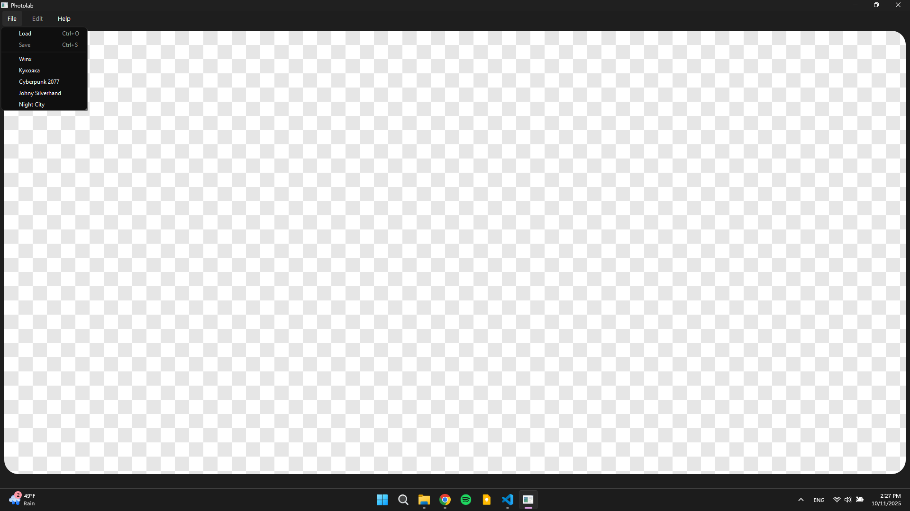
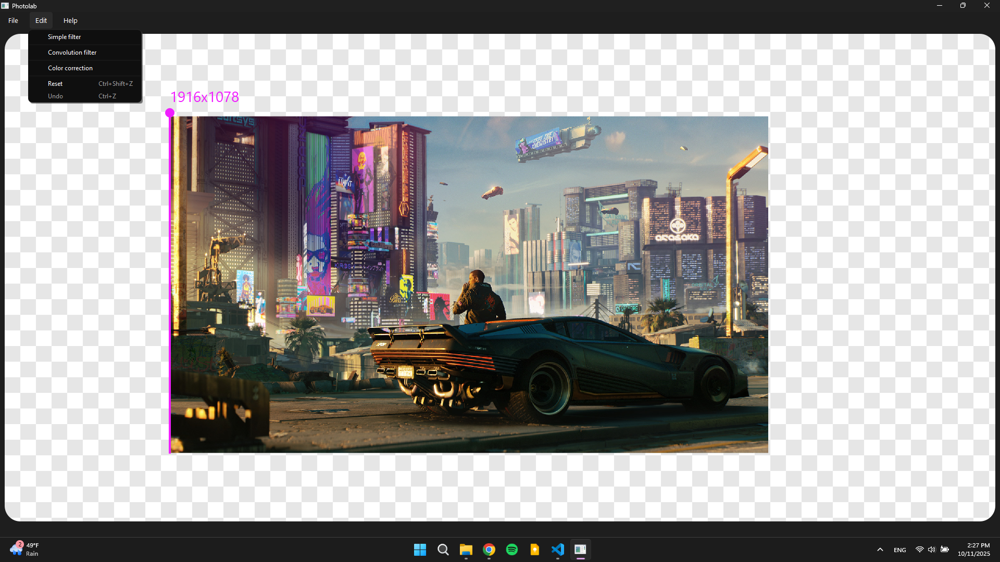
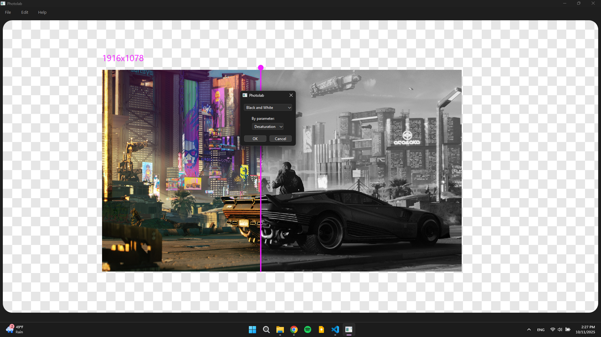
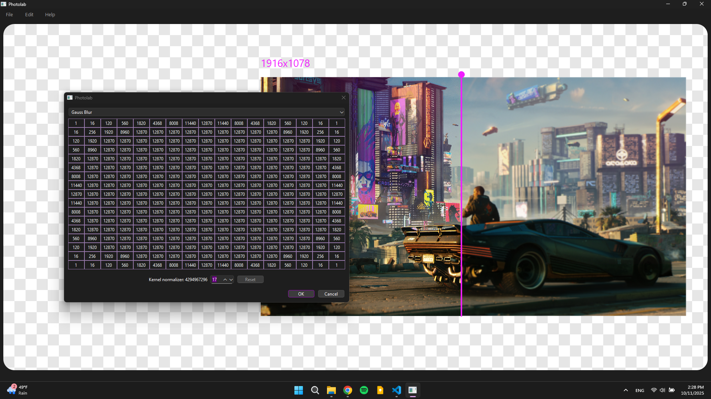
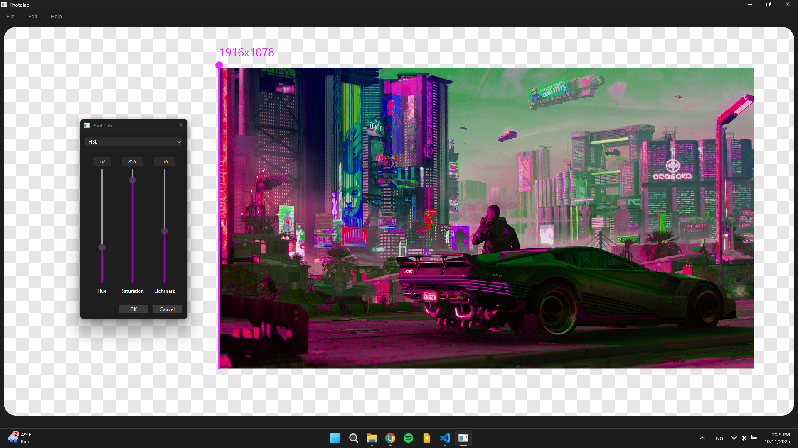

# PhotoLab v1.0

The Photolab project is to make some filter on .bmp, .jpg, .png images.
There are few simple filters, color corrections, and kernel filters based on some predefined kernels as well as ability to apply custom one. App let user to load some images as well as use preloaded images can be find in 'File' menu. Edited images can be saved in chosen by user folder.

App developed with QtWidgets/C++20.

## Makefile comands
- `make install` build app into build/release/ with necessary libs.
- `make run` runs app after it have been installed.
- `make uninstall` just removes build directory
- `make dist` after app have been installed creates a Photolab directory in project root, and place an app and necessary libs.
- `make tests` clones Gtest repository, build into test_build directory and run tests
- `make clean` removes build, Gtest, Photolab, test_build directories

## GUI

### Controls
<ul>
  <li>Use <b>Mouse wheel</b> to scale image.</li>
  <li>Drug <b>mouse with LEFT mouse button pressed</b> to shift cutter line.</li>
  <li>Drug <b>mouse with RIGHT mouse button pressed</b> to move image in view space.</li>
  <li>Use <b>Edit->reset</b> to set view into default state</li>
</ul>

### Menu `File`

### Menu `Edit`

### Simple filter control

### Kernel filter control

### Color Correction control

